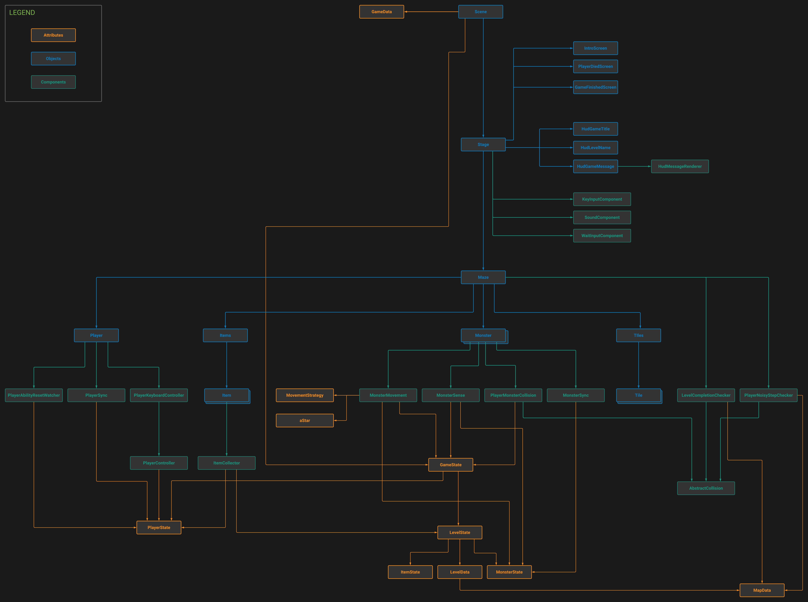

# Escape the Dungeon game

* Genre: Maze (horror) game
* Library: PixiJS

The goal of the game is to escape the dungeon level by level.  
There are monsters in the dungeon that try to kill the player.  
Player can make noise to sidetrack the monsters, but has to be careful because the monsters in surroundings will move his way than.  
In specific level, some power-up items can be used to finish that level.

Available online at https://escape-the-dungeon-game.4fan.cz.

## How to run this project
- the project is powered by ParcelJS, TypeScript, PixiJS and ECSLite libraries
- install [NodeJS](https://nodejs.org/en/download/)
- execute `npm install`
- execute `npm run dev`
- go to `localhost:1234` and find your template there

## Architecture

## Other scripts
- lint: run `npm run lint` to see if there are linting errors. You can fix them by using `npm run lint -- --fix`
- compilation test: run `npm run compile-test` to see if there are any TypeScript errors. The default building process provided by ParcelJS doesn't check for syntactic errors. Instead, it just skips them. Yet, you should be able to see them underlined in your IDE
- deployment: run `npm run deploy` and find your project in the `build` folder

## Deployment version
- if you are new to web technologies, keep in mind that your browser will not allow you to load any assets from your file system. That is, you need to run a web-server in order to access any files
- this is done automatically by a web-server that is shipped with ParcelJS
- if you run `npm run dev`, you will find your webserver at `localhost:1234` and everything is fine
- if you, however, deploy your project, and open the `index.html` file located in the `build` folder, the game will not run, unless you deploy it to a web-server (NGinx, XAMPP, or a real web server like S3Bucket or Heroku)